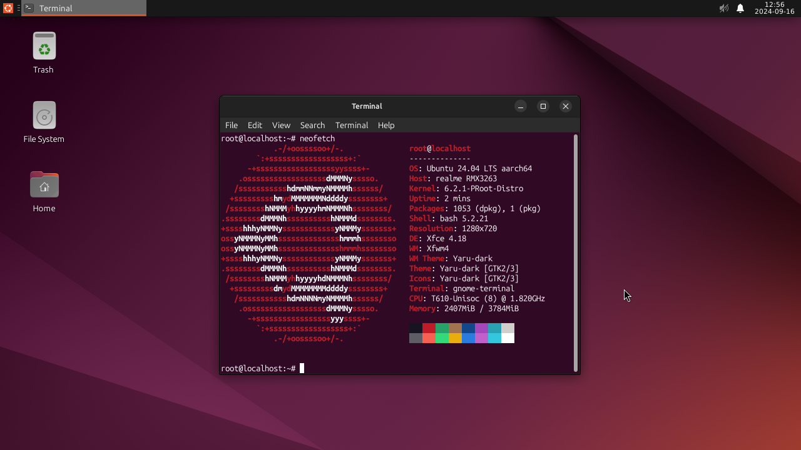
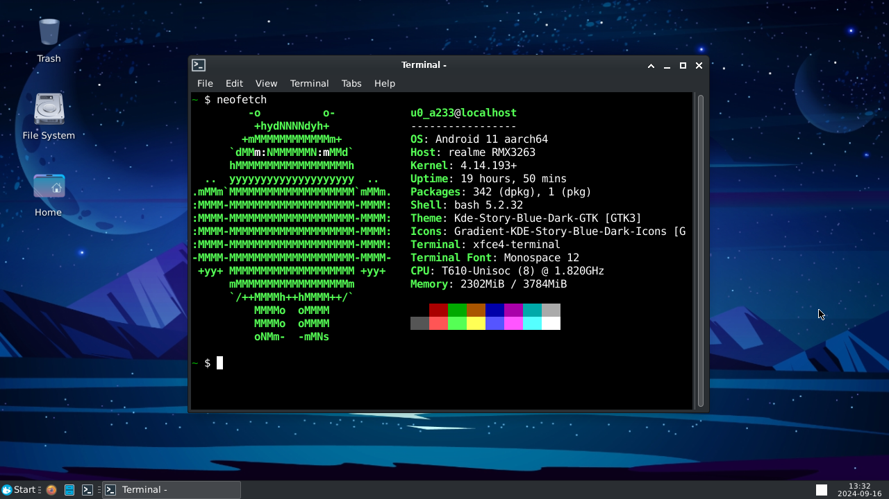

# ModDesk
<b><p>Easily install Modded Desktop on Android without Root</p></b>

### Preview
|Ubuntu Desktop|Termux Desktop|
|--|--|
|||

### Requirements
- Android device running Android 7 (No Root Required)
- Termux, Get it from from their <a href="https://github.com/termux/termux-app/releases/latest">github</a> or <a href="https://f-droid.org/en/packages/com.termux/">fdroid</a>
- VNC viewer, Get it from  <a href="https://play.google.com/store/apps/details?id=com.realvnc.viewer.android">playstore</a>
- 3-4GB of Storage
- 3 GB RAM (4 GB recommended)

### Installation
Paste following command in Termux
```
# install for ubuntu
bash <(curl -s https://raw.githubusercontent.com/kakgem4177/termux-modded-desktop/main/install.ubuntu.sh)

# install for termux
Coming Soon!
```
